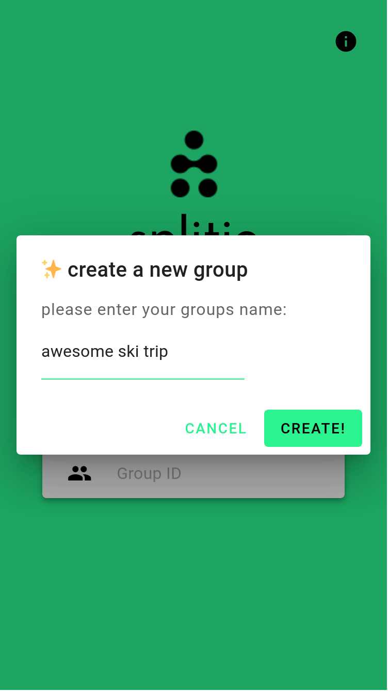
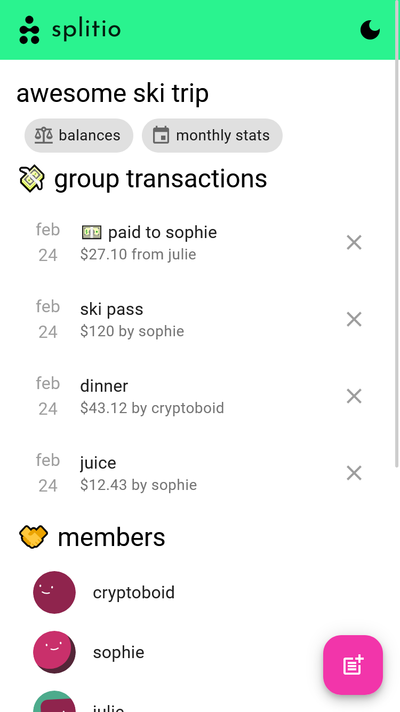
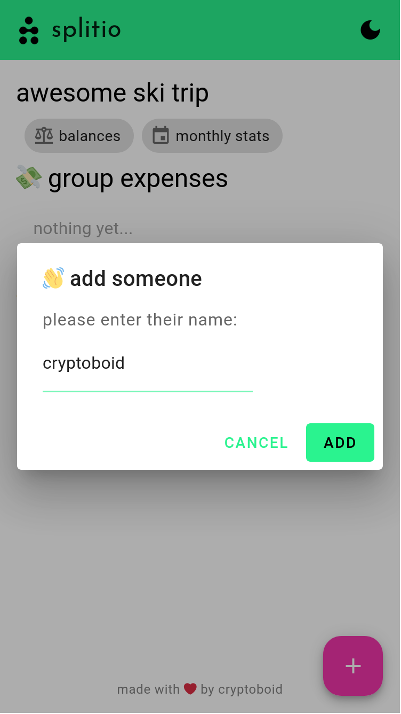
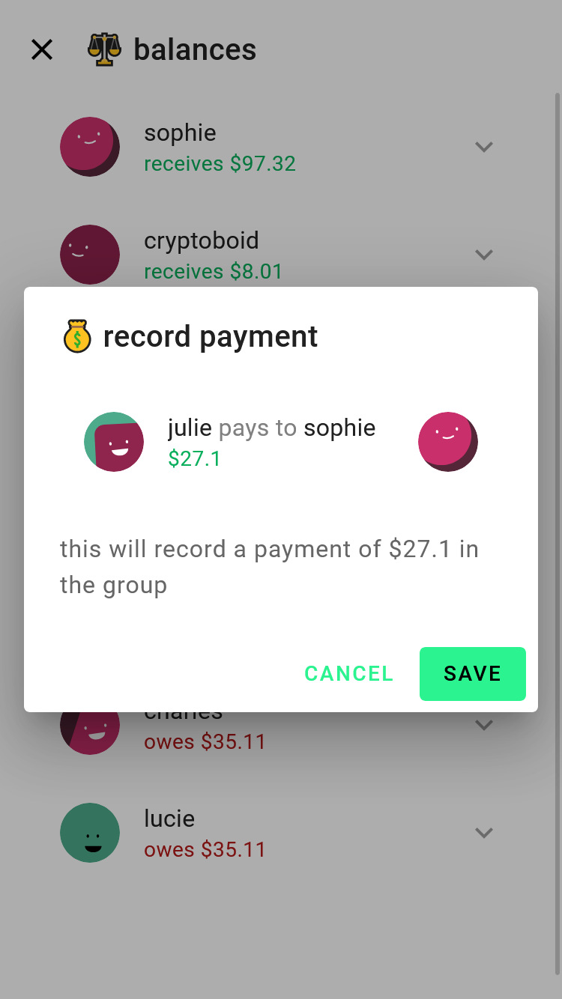

    
    <h1 align="center">splitio</h1>

  
  

split your bills easily! splitio is an open-source webapp built for tracking debts and
payments quickly, without any user accounts.

information is p2p distributed using gun and end-to-end encrypted using gun/sea.

built with SvelteKit and GunDB.

## 🤔 how to use

1. go to https://splitio.vercel.app (or self-host yours!)
2. create a group with any name
3. send your friends the long url to start sharing bills! no accounts required

## 🌟 showcase
<table>
<tr>
    
    
    
    

</tr>
<tr>
    
    
    

</tr>
</table>

## 📝 next steps

some extra desired features/fixes are:
- better storage persistance with ["persistent" mode](https://developer.mozilla.org/en-US/docs/Web/API/Storage_API#box_modes)
- implement own relays with [write protections](https://github.com/cryptoboid/splitio/issues/19) --> [in progress!](https://github.com/cryptoboid/splitio/commit/786445f79cd4a10ea9762dbfcb2ed24737086c2d)
- ~~compute who-owes-what~~ (done!)
- ~~add settlements~~ (done! just click on who you want to pay in the balances dialog)
- ~~show date in group transactions~~ (done!)
- ~~show recently viewed groups in home~~ (done!)
- ~~favorite a group for easy access in PWA (or provide some kind of shortcut)~~ (disabled PWA for now)
- ~~support for more complex expenses: shared payment, divide by a subgroup~~ (must change storage model, too complicated for now)
- ... and more!

